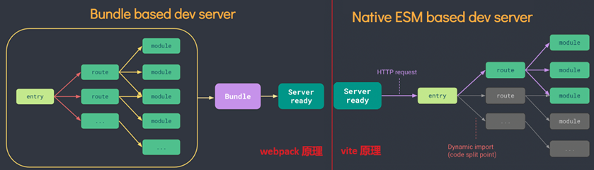

[Vue3学习小结--1简介](#top)

- [特点](#特点)
- [创建vue工程](#创建vue工程)
- [Vue Component](#vue-component)
- [vue-devtools](#vue-devtools)

-------------------------------------

## 特点

- 2020年9月18日，Vue.js 发布 3.0 版本，代号：One Piece（海贼王）
- 渐进式框架
  - 无需构建步骤，渐进式增强静态的 HTML
  - 在任何页面中作为 Web Components 嵌入
  - 单页应用 (SPA)
  - 全栈 / 服务端渲染 (SSR)
  - Jamstack / 静态站点生成 (SSG)
  - 开发桌面端、移动端、WebGL，甚至是命令行终端中的界面
- Web 之外
  - 配合 Electron 构建桌面应用
  - 配合 Ionic Vue 构建移动端应用
  - 使用 Quasar 或 Tauri 用同一套代码同时开发桌面端和移动端应用
  - 使用 TresJS 构建 3D WebGL 体验
  - 使用 Vue 的自定义渲染 API 来构建自定义渲染器，比如针对终端命令行的
- 新的特性
  1. Composition API（组合 API）
      - setup 配置
      - ref 与 reactive
      - watch 与 watchEffect
      - provide 与 inject
      - ......
  2. 新的内置组件:   Fragment, Teleport,  Suspense
  3. 其他改变
      - 新的生命周期钩子
      - data 选项应始终被声明为一个函数
      - 移除 keyCode 支持作为 v-on 的修饰符
      - ...... 

|||
|---|---|
|性能的提升|打包大小减少41%<br>初次渲染快55%，<br>更新渲染快133%内存减少54%|
|源码的升级|使用Proxy代替defineProperty实现响应式<br>重写虚拟DOM的实现和Tree-Shaking|
|拥抱TypeScript|Vue3可以更好的支持TypeScript|
|新的特性||
|Composition Api(组合Api)|setup, ref和reactive, computed与watch,…|
|新的内置组件|Fragment,Teleport,Suspense,…|
|其他改变|新的生命周期钩子<br>data选项应始终被声明为一个函数<br>移除keyCode支持作为v-on的修饰符|

### 重写双向绑定

```ts
vue2
基于Object.defineProperty()实现

vue3 基于Proxy
proxy与Object.defineProperty(obj, prop, desc)方式相比有以下优势：

//丢掉麻烦的备份数据
//省去for in 循环
//可以监听数组变化
//代码更简化
//可以监听动态新增的属性；
//可以监听删除的属性 ；
//可以监听数组的索引和 length 属性；
    let proxyObj = new Proxy(obj,{
        get : function (target,prop) {
            return prop in target ? target[prop] : 0
        },
        set : function (target,prop,value) {
            target[prop] = 888;
        }
    })
```

### Vue3优化Vdom

在Vue2中,每次更新diff,都是全量对比,Vue3则只对比带有标记的,这样大大减少了非动态内容的对比消耗

[⬆ back to top](#top)

## 创建vue工程

- 使用vue-cli： `npm create vue@latest`
- 使用Vite: `npm create vite@latest`
- vite-env.d.ts: 
  - client.d.ts
- main.ts: vue3通过`createApp`函数来创建一个应用实例

```
├── 📂public/                      - 下面的不会被编译 可以存放静态资源
├── 📂src/ 
|    ├── 📂assets/                  - 存放可编译的静态资源
|    ├── 📂component/               - 
|    |     ├── 📄HelloWorld.vue
|    |     └── 
|    ├── 📄App.vue                  - 全局组件
|    ├── 📄style.css
|    ├── 📄main.ts                  - 全局的ts文件
|    └── 📄vite-env.d.ts            - 让ts认识一些类型的文件
├── 📄index.html                    -入口文件
├── 📄tsconfig.json
├── 📄tsconfig.node.json
└── 📄vite.config.ts
```



[⬆ back to top](#top)

## Vue Component

```ts
<template>
  <div class="app">
    <h1>Hello</h1>
  </div>
</template>
<script lang="ts">
  export default {
    name: 'App'     //name of component
  }
</script>
<style>
  .app {
    backgroung-color: #ddd;
    box-shadow: 0 0 10px;
    border-radius: 10px;
    padding: 20px;
  }
</style>
```

[⬆ back to top](#top)

## vue-devtools

- [Tooling-official](https://vuejs.org/guide/scaling-up/tooling.html)
- 链接:https://pan.baidu.com/s/139hspAnspD7bJbo81xigmg 密码:1hsv
- `git clone https://github.com/vuejs/vue-devtools.git`
  - `npm run build`
  - 游览器输入地址“chrome://extensions/”进入扩展程序页面，点击“加载已解压的扩展程序...”按钮，选择vue-devtools>shells下的chrome文

> https://www.cnblogs.com/Itstars/tag/vue.js/
