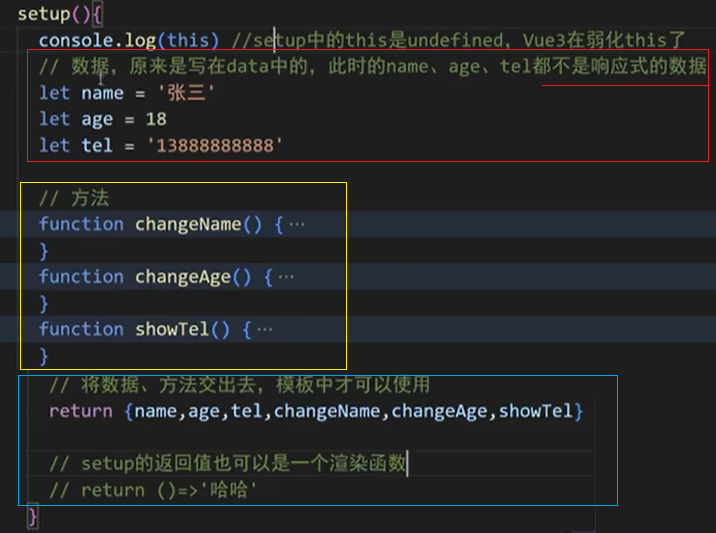

[Vue3学习小结--OptionsAPI、CompositionAPI与setup](#top)

- [API 风格](#api-风格)
- [选项式API - Options API](#选项式api---options-api)
- [组合式API - Composition API](#组合式api---composition-api)
- [setup](#setup)
  - [setup的返回值](#setup的返回值)
  - [setup的语法糖](#setup的语法糖)
  - [setup的两个注意点](#setup的两个注意点)

-------------------------------------

## API 风格

- 选项式 API (Options API)： 用包含多个选项的对象来描述组件的逻辑(Vue2)
  - API,数据、方法、计算属性等，是分散在data、methods、computed中的，如想新增或修改一个需求，就需要分别修改data、methods、computed，不便于维护和复用
- 组合式 API（Composition API）：使用导入的 API 函数来描述组件逻辑(Vue3)


## 选项式API - Options API


```ts
//1) Options API
<script>
export default {
  // data() 返回的属性将会成为响应式的状态 并且暴露在 `this` 上
  data() {
    return { count: 0 }
  },
  // methods 是一些用来更改状态与触发更新的函数  它们可以在模板中作为事件处理器绑定
  methods: {
    increment() { this.count++ }
  },
  // 生命周期钩子会在组件生命周期的各个不同阶段被调用  例如这个函数就会在组件挂载完成后被调用
  mounted() {
    console.log(`The initial count is ${this.count}.`)
  }
}
</script>
<template>
  <button @click="increment">Count is: {{ count }}</button>
</template>
```

[⬆ back to top](#top)

## 组合式API - Composition API

- 
- 

```ts
<script setup>       //setup的语法糖
  import { ref, onMounted } from 'vue'
  // 响应式状态
  const count = ref(0)
  // 用来修改状态、触发更新的函数
  function increment() {
    count.value++
  }
  // 生命周期钩子
  onMounted(() => {
    console.log(`The initial count is ${count.value}.`)
  })
</script>
<template>
  <button @click="increment">Count is: {{ count }}</button>
</template>
```

[⬆ back to top](#top)

## setup

- setup是Vue3中一个新的配置项，值是一个函数，Composition API组件中所用到的：数据、方法、计算属性、监视…等等，均配置在setup中
- setup 是所有<strong style="color:#DD5145">Composition API（组合 API）</strong><i style="color:gray;font-weight:bold">“ 表演的舞台 ”</i>, 特点：
  - setup函数返回的对象中的内容，可直接在模板中使用
  - setup中访问this是undefined
  - setup函数会在beforeCreate之前调用，它是"领先"所有钩子执行的
- 注意：选项式写法和setup混写的话:data、methods等中可以访问setup中定义的数据，但是**setup中不能访问data等中定义的数据**

### setup的返回值

- 
- setup 函数的两种返回值：
  1. 若返回一个对象，则对象中的属性、方法, 在模板中均可以直接使用。（重点关注！）
  2. <span style="color:#aad">若返回一个渲染函数：则可以自定义渲染内容。（了解）</span>
- setup 不能是一个 async 函数，因为返回值不再是 return 的对象, 而是 promise, 模板看不到 return 对象中的属性。（后期也可以返回一个 Promise 实例，但需要 Suspense 和异步组件的配合）
- setup中可以读取选项式API中data的数据，但反之则不可读

### setup的语法糖

- `npm i vite-plugin-vue-setup-extend`
- modify 'vite.config.ts'
- 可以使用`<script lang="ts" setup name="Person234">`
  - 把name和setup放在一个script中
  - 不用写return

```ts
//vite.config.ts
import VueSetupExtend from 'vite-plugin-vue-setup-extend'
export default defineConfig({
  plugins: [
    vue(),
    VueSetupExtend()
  ]
})
//Person.vue
<script lang="ts" setup name="Person234">
  // setup中的this是undefined
  let name = 'zhang san';   //此时的数据不是响应式的
  let age = 18;
  let tel = '111111111';
  function showName() {
    name = '张三'
    alert(name);
  }
</script> 
```

### setup的两个注意点

- setup 执行的时机
  - 在 beforeCreate 之前执行一次，this 是 undefined。
- setup 的参数
  - props：值为对象，包含：组件外部传递过来，且组件内部声明接收了的属性。
  - context：上下文对象
    - attrs: 值为对象，包含：组件外部传递过来，但没有在 props 配置中声明的属性, 相当于 `this.$attrs`。
    - slots: 收到的插槽内容, 相当于 `this.$slots`。
    - emit: 分发自定义事件的函数, 相当于 `this.$emit`。

[⬆ back to top](#top)

> References
- https://cn.vuejs.org/api/composition-api-setup.html
- [做了一夜动画，就为让大家更好的理解Vue3的Composition Api](https://juejin.cn/post/6890545920883032071)
-  https://www.cnblogs.com/Itstars/tag/vue.js/
