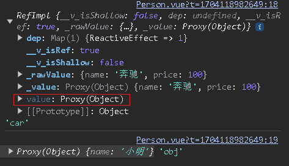

[Vue3学习小结--响应式数据ref、reactive和toRefs、toRef](#top)

- [Vue3中的响应式原理](#Vue3中的响应式原理)
  - [vue2.x的响应式](#vue2.x的响应式)
  - [vue3的响应式](#vue3的响应式)
- [Ref基本数据类型的响应式数据](#ref基本数据类型的响应式数据)
- [reactive对象类型的响应式数据](#reactive对象类型的响应式数据)
- [ref对比reactive](#ref对比reactive)
- [toRefs和toRef](#torefs和toref)

-------------------------------------

## Vue3中的响应式原理

### vue2.x的响应式

- 实现原理：
  - 对象类型：通过`Object.defineProperty()`对属性的读取、修改进行拦截（数据劫持）
  - 数组类型：通过重写更新数组的一系列方法来实现拦截。（对数组的变更方法进行了包裹）
    ```js
    Object.defineProperty(data, "count", {
      get() {},
      set() {},
    });
    ```
- 存在问题：
  - 新增属性、删除属性, 界面不会更新
  - 直接通过下标修改数组, 界面不会自动更新

### vue3的响应式

- 实现原理:
  - 通过 Proxy（代理）: 拦截对象中任意属性的变化, 包括：属性值的读写、属性的添加、属性的删除等
  - 通过 Reflect（反射）: 对源对象的属性进行操作
  - MDN 文档中描述的 Proxy 与 Reflect：
    - Proxy：https://developer.mozilla.org/zh-CN/docs/Web/JavaScript/Reference/Global_Objects/Proxy
    - Reflect：https://developer.mozilla.org/zh-CN/docs/Web/JavaScript/Reference/Global_Objects/Reflect
```js
      new Proxy(data, {
        // 拦截读取属性值
        get(target, prop) {
          return Reflect.get(target, prop);
        },
        // 拦截设置属性值或添加新属性
        set(target, prop, value) {
          return Reflect.set(target, prop, value);
        },
        // 拦截删除属性
        deleteProperty(target, prop) {
          return Reflect.deleteProperty(target, prop);
        },
      });
      proxy.name = "tom";
```

[⬆ back to top](#top)

## Ref基本数据类型的响应式数据

|||
|---|---|
|作用|定义响应式变量|
|语法|let xxx = ref(初始值)|
|操作数据|JS 中操作数据： `xxx.value`<br>模板中读取数据: 不需要.value，直接：`<div>{{xxx}}</div>`|
|返回值|一个RefImpl的实例对象，简称ref对象或ref,ref对象的value属性是响应式的|
|注意点|接收的数据可以是：基本类型、也可以是对象类型<br>基本类型的数据：响应式依然是靠`Object.defineProperty()`的`get`与`set`完成的|

```ts
<script lang="ts" setup name="Person">
  // 1) import ref
  import { ref } from 'vue';
  // 2) using ref() in data defination
  let name = ref('zhang san');   //此时的数据是响应式的
  let age = ref(18);
  let tel = '111111111';
  console.log('name', name);
  function changeName() {
  // 3) change data by usibng .value
    name.value = 'Li Si'
    console.log(name.value)
  }
  function showTel() {
    alert(tel);
  }
</script> 
```

[⬆ back to top](#top)

## reactive对象类型的响应式数据

|||
|---|---|
|作用|只能定义对象类型|
|语法|let xxx = reactive({xxx})|
|返回值| 一个Proxy的实例对象，简称:proxy对象|
|注意点|reactive定义的响应式数据是“深层次”的<br>内部基于 ES6 的 Proxy 实现，通过代理对象操作源对象内部数据进行操作|



```ts
<script lang="ts" setup name="Person">
 // 1) import reactive
  import { reactive } from 'vue';
 // 2) using ref() in data defination
  let car = reactive({name: 'benchi', price: 100})     //此时的数据不是响应式的
  let hobbies = reactive([       //此时的数据不是响应式的
    {id: '1', name: 'cigaret'},
    {id: '2', name: 'drink'},
    {id: '3', name: 'hair'},
  ]);  
  function changePrice() {
    car.price += 10
  }
  function changeHobby() {
    hobbies[0].name = 'reading'
  }
</script> 
```

[⬆ back to top](#top)

## ref对比reactive

- ref用来定义：基本类型数据、对象类型数据
  - ref创建的变量必须使用.value
- reactive用来定义：对象类型数据
  - 修改属性： 直接使用  ->  `hobbies[0].name = 'reading'`
  - 修改整体对象：reactive重新分配一个新对象,会失去响应式（可以使用Object.assign去整体替换）

```ts
let obj = reactive({name: '小明'})
function changeObj(){
  // obj = {name: '小红'}              // 这么写页面不更新
  // obj = reactive({name: '小红'})    // 这么写页面不更新
  Object.assign(obj, {name: '小白'})
}
```

**使用原则**：

- 若需要一个基本类型的响应式数据，必须使用ref
- 若需要一个响应式对象，层级不深，ref、reactive都可以
- 若需要一个响应式对象，且层级较深，推荐使用reactive，（form表单数据推荐使用reactive）


## toRefs和toRef

- **作用**：将一个响应式对象中的每一个属性，转换为ref对象
- **备注**：toRefs与toRef功能一致，但toRefs可以批量转换

```ts
<script lang="ts" setup name="Person">
  import { reactive, toRefs } from 'vue';
  let person = reactive({
    name: 'Zhang san',
    age: 19
  });
  let { name, age } = toRefs(person)
  console.log(name)
  console.log(age)
  function changeName() {
    //person.name = 'Li si'
    name.value = 'toRefs'
  }
  function changeAge() {
    //person.age += 1
    age.value += 1
  }
</script> 
```

[⬆ back to top](#top)

> References
-  https://www.cnblogs.com/Itstars/tag/vue.js/
-  [Vue学习计划-Vue3--核心语法（二）ref、reactive和toRefs、toRef](https://www.cnblogs.com/Itstars/p/17966834)
