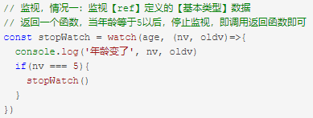
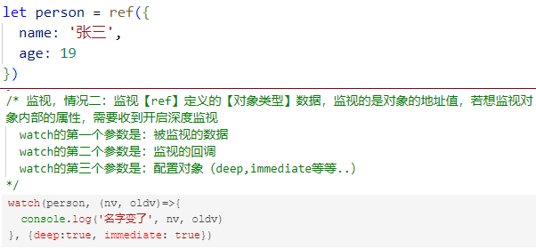
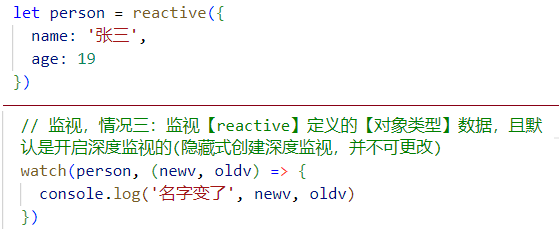
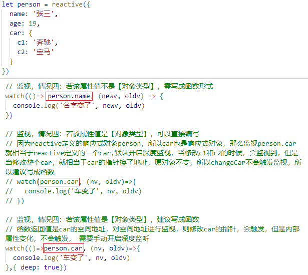
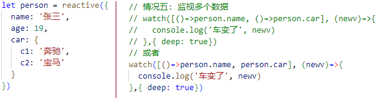

[Vue3学习小结4--computed计算属性、watch监听、watchEffect函数](#top)

- [computed计算属性](#computed计算属性)
- [watch与watchEffect](#watch与watcheffect)
  - [watch](#watch)
  - [watchEffect](#watcheffect)

-------------------------------------

## computed计算属性

- 作用：根据已有数据计算出新数据（和Vue2中的computed作用一致）
- 使用： `get()`, `set()`

```ts
<script lang="ts" setup name="Person">
  import { ref, computed } from 'vue';
  let firstName = ref('Zhang')
  let lastName = ref('San')
  let fullName = computed({   //fullName是一个计算属性
      //读取就会调用
      get() {
        return firstName.value.slice(0,1).toUpperCase() + firstName.value.slice(1) + '-' + lastName.value.slice(1)
      },
      // 变化就会调用
      set(val) {
        let [str1, str2] = val.split('-')
        firstName.value = str1
        lastName.value = str2
      }
   })
  function changeFullName() {
    fullName.value = 'li-si'
  }
</script> 
```

[⬆ back to top](#top)

## watch与watchEffect

### watch

- 作用：监视数据的变化（和Vue2的watch作用一致）
- 特点：Vue3中的watch只能监视以下4种数据：
  1. ref定义的数据
  2. reactive定义的数据
  3. 函数返回一个值（getter函数）
  4. 一个包含上述内容的数组

||||
|---|---|---|
|情况一|监视ref定义的【基本类型】数据：直接写数据名即可，<br>监视的是其value值的改变|  |
|情况一|监视ref定义的【对象类型】数据：直接写数据名，监视的是对象的【地址值】，<br>若想监视对象内部的数据，要手动开启深度监视|  |
|情况三|监视reactive定义的【对象类型】数据, 默认开启深度监视|  |
|情况四|监视ref或reactive定义的【对象类型】数据的某个属性<br>1. 若该属性值不是【对象类型】，需写成函数形式<br>2.若该属性值是【对象类型】，可直接编写，也可以写成函数，建议写成函数<br>结论：监视的要是对象里的属性，那么最后写函数式，<br>注意点：若是对象监视的是地址值，需要关注对象内部，需要手动开启深度监视|  |
|情况五|监视多个数据|  |

[⬆ back to top](#top)

### watchEffect

- 立即运行一个函数，同时响应式的追踪其依赖，并在依赖更改时重新执行该函数
- `watch`对比`watchEffect`
  1. 都能监听响应式数据的变化，不同的是监听数据变化的方式不同
  2. `watch`：要明确指出监视的数据
  3. `watchEffect`: 不用明确指出监视的数据（函数中用到哪些属性，那就监视哪些属性）

```ts
const stopWatch = watchEffect(()=>{
    if(temp.value >= 60 || height.value >= 20){
      console.log('调取接口', temp.value, height.value )
    }
    if(temp.value === 100 || height.value === 50){
      console.log('停止监视', temp.value, height.value )
      stopWatch()
    }
})
```

[⬆ back to top](#top)

> References
- https://cn.vuejs.org/api/reactivity-core.html
- https://www.cnblogs.com/Itstars/tag/vue.js/
- [Vue学习计划-Vue3--核心语法（三）computed计算属性、watch监听、watchEffect函数](https://www.cnblogs.com/Itstars/p/17966832)


