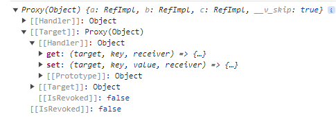

[Vue3学习小结5--标签的ref属性、props父子通信](#top)

- [标签的ref属性](#标签的ref属性)
  - [普通DOM标签](#普通dom标签)
  - [组件标签](#组件标签)
- [props父=\>子通信](#props父子通信)

-------------------------------------

## 标签的ref属性

- 作用：用于注册模板引用
  1. 用在普通DOM标签上，获取的使DOM节点
  2. 用在组件标签上，获取的是组件实例对象

### 普通DOM标签

```vue
<h3 ref="test">呵呵呵呵</h3>
//...
let test = ref();
  function showLog() {
    console.log(test.value)    //<h3 rdata-v-4cadc14e>呵呵呵呵</h3>
  }
```

### 组件标签

```vue
// 父组件内 App.vue
<template>
  <button @click="showChild">显示组件ref</button>
  <Person ref="child"/>
</template>
<script lang="ts" setup name="App">
import Person from './components/Person.vue'
import { ref } from 'vue'
  let child = ref()
  function showChild(){
    // 直接打印出子组件实例对象，
    // 但是因为保护机制，所以想要访问子组件内的数据，还需要在子组件内使用defineExpose导出想要访问的数据
    console.log(child.value)
  }
</script>
/ 子组件内 Person.vue
<template>
  <div>
    <h2>哈哈</h2>
    <h2 ref="test">呵呵呵呵</h2>
    <h2>这是第三行了</h2>
    <button @click="showLog">修改高度</button>
  </div>
</template>
<script lang="ts" setup name="Person234">
  import { ref, defineExpose } from 'vue'
  let test = ref()
  function showLog(){
    console.log(test.value)
  }

  let a = ref(0)
  let b = ref(2)
  let c = ref(3)
  // 要想父组件访问子组件的数据，必须使用defineExpose 导出想要被访问的数据
  defineExpose({a, b, c})
</script>
```



[⬆ back to top](#top)

## props父=>子通信

- 使用`defineProps`**接收**参数
  - `definexxx`的函数可以不用引入
  - `defineProps`可以直接使用泛型
- 使用`withDefaults`函数将`defineProps`接收的`props`参数作为第一个参数包裹起来，并第二个参数里设置默认值

```vue
// 父组件
<template>
  <div class="app">
    <Person a="9" :list="personList"/>
  </div>
</template>
// 子组件
<div class="person">
    <ul>
      <li v-for="p in list" :key="p.id">
        {{ p.name }} - {{ p.age }}
      </li>
    </ul>
  </div>
</template>
<script lang="ts" setup name="Person">
  import { defineProps, withDefaults } from 'vue';
  import { type Persons} from '../types/index'
  // 1. 默认接收props数据
  // defineProps(['list'])
  /*
  *   2. 加入ts之后的props
  */
  // 2-1. defineProps可以加ts限制传入的值的类型
  //  defineProps函数有返回值，返回所接收的props的集合
  // let c = defineProps<{list:Persons,a:string}>()
  // console.log(c.list, 'cc')

  // 2-2. 接收传入的值，+限制类型， +必填项， +默认值
  // ts的?限制是否必填
  // withDefaults设置默认值
  withDefaults(defineProps<{list?: Persons}>(), {
    list: () => [{id: 'sdadsa', name: '这是默认de', age: 99}]
  })
</script> 
```

[⬆ back to top](#top)

> References
- https://cn.vuejs.org/api/reactivity-core.html
- https://www.cnblogs.com/Itstars/tag/vue.js/
- [Vue学习计划-Vue3--核心语法（四）标签的ref属性、props父子通信](https://www.cnblogs.com/Itstars/p/17966833)


