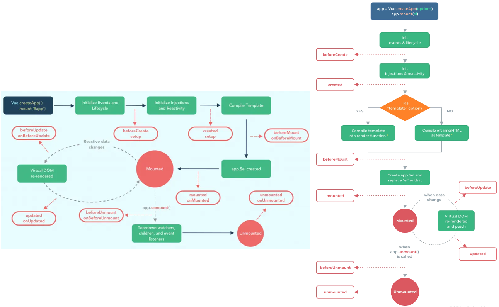
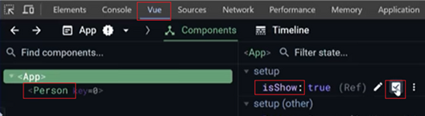
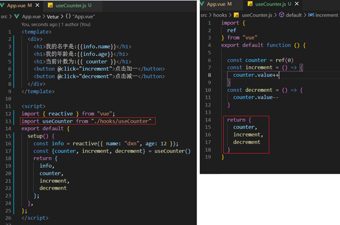

[Vue3学习小结6--生命周期Lifecycle、自定义Hook](#top)

- [生命周期Lifecycle](#生命周期lifecycle)
- [自定义Hook](#自定义hook)
  - [Vue3内置Hooks](#Vue3内置Hooks)
  - [Vue3自定义Hooks](Vue3自定义Hooks)
  - [常用的第三方Hooks推荐](#常用的第三方hooks推荐)
  - [vue3 hooks的网站以及文章](#vue3-hooks的网站以及文章)

-------------------------------------

## 生命周期Lifecycle

生命周期整体分为四个阶段：分别是：创建、挂载、更新、销毁，每个阶段都有两个钩子，一前一后

||Vue2|Vue3|
|---|---|---|
|创建阶段|beforeCreate、created|setup|
|挂载阶段|beforeMount、mounted|onBeforeMount、onMounted|
|更新阶段|beforeUpdate、updated|onBeforeUpdate、onUpdated|
|销毁阶段|beforeDestroy、destroyed|onBeforeUnmount、onUnMounted|



```ts
//App.vue
<template>
  <div class="app">
    <Person v-if="isShow"/>
  </div>
</template>
<script lang="ts" setup name="App">
  import Person from './components/Person.vue';
  import { ref, onMounted } from 'vue'
  let isShow = ref(true)
  onMounted(() => {
    console.log('父-挂载完毕 Mounted')
  })
</script>

//Person.vue
<template>
  <div class="person">
    <h2>当前值为{{ num }}</h2>
    <button @click="changeSum">点击加1</button>
  </div>
</template>
<script lang="ts" setup name="Person">
  import {ref, onBeforeMount, onMounted, onBeforeUpdate, onUpdated, onBeforeUnmount, onUnmounted} from 'vue'
  let num = ref(0)
  function changeSum() {
    num.value += 1
  }
  console.log('创建 setup')
  onBeforeMount(() => {
    console.log('挂载之前 BeforeMount')
  })
  onMounted(() => {
    console.log('子-挂载完毕 Mounted')
  })
  onBeforeUpdate(() => {
    console.log('更新之前 BeforeUpdate')
  })
  onUpdated(() => {
    console.log('更新完毕 Updated')
  })
  onBeforeUnmount(() => {
    console.log('卸载之前 BeforeUnmount')
  })
  onUnmounted(() => {
    console.log('卸载完毕 Unmounted')
  })
</script> 
```



[⬆ back to top](#top)

## 自定义Hook

- hooks本质是一个函数，把setup函数中使用的Composition API进行了封装，就是将文件的一些单独功能的js代码进行抽离出来，放到单独的js文件中, 类似与Vue2中的mixin
- 自定义hook的优势：
  - 复用代码: 当多个组件需要共享相同的逻辑时，我们可以将这些逻辑封装成一个Hook，然后在需要的组件中导入并使用它。这样可以避免代码重复，提高代码的复用性
  - 逻辑拆分：对于复杂的组件，我们可以使用Hooks将组件的逻辑拆分成多个独立的函数，每个函数负责处理一部分逻辑。这样可以使组件的代码更加清晰、易于维护
  - 副作用处理: 使用watch或watchEffect来监听响应式数据的变化，并执行相应的副作用（如定时器、事件监听等）
- 在src中创建一个hooks文件夹，用来存放hook文件
  - hooks文件夹中，每一个功能的hook文件期望是usexxx命名的
  - 

### Vue3内置Hooks

- useAttrs()
- useSlots()
- useMouse()
- useFetch()
- useSSRContext()

### Vue3自定义Hooks

```ts
// hooks/useDog.ts
import { reactive, onMounted } from 'vue'
import axios from 'axios'
export default function() {
  let dogList = reactive([
    'https://images.dog.ceo//breeds//pembroke//n02113023_13200.jpg'
  ])
  async function getDog() {
    try {
      let result = await axios.get('https://dog.ceo/api/breed/pembroke/images/random')
      // console.log(result.data.message)
      dogList.push(result.data.message)
    } catch (error) {
      alert(error)
    }
  }
  onMounted(() => {
    getDog()
  })
  //向外提供东西
  return {dogList, getDog}
}
//hooks/useSum.ts
```

### 常用的第三方Hooks推荐

- [Vueuse](https://vueuse.org/)：Vueuse是一个基于Vue3 Composition API的实用函数集合，包含了大量有用的自定义Hooks，如useMouse、useKeyboardJs、useLocalStorage等。它是Vue3生态中最受欢迎的第三方Hooks库之一。
- @vue/reactivity：这是Vue官方提供的响应式库，虽然它不是一个Hooks库，但其中的函数和工具可以与Composition API结合使用，帮助我们创建自定义的Hooks来处理响应式数据和副作用。例如，我们可以使用reactive、ref、computed等函数来创建响应式数据和计算属性

### vue3 hooks的网站以及文章

|开源库与开源项目中的hooks|useful|
|---|---|
|[vue3官方推荐社区项目：VueUse](https://www.vueusejs.com/)| useResizeObserver、useTitle、useClipboard、useDraggable|
|[ahooks-vue](https://github.com/dewfall123/ahooks-vue)|useRequest、useAxios、useFullscreen、useTable|
|[个人封装的hooks 库](https://github.com/lmhcoding/vhook)||
|[vue-hooks](https://github.com/u3u/vue-hooks)|useDate、useStore、useActions|
|[vue-use-web](https://github.com/Tarektouati/vue-use-web)||
|[vue-hooks-plus](https://github.com/InhiblabCore/vue-hooks-plus)|包含47个高质量 & 可靠 hook函数 其中useRequeset 、useWebSocket、useFetchs等都很优秀|
|[针对 Vue3 的实用Hooks集合](https://github.com/yanzhandong/v3hooks)||
|[20kstars 的后台管理项目：vue-vben-admin](https://github.com/vbenjs/vue-vben-admin/tree/main/src/hooks)|很多 表格表单hooks, 其中包含useContext、useScroll、useEventListener、useTable、useTitle|
|[vue3-antd-admin](https://github.com/buqiyuan/vue3-antdv-admin/tree/main/src/hooks)|其中的useI18n useModal、useEventbus 方案都很优秀|

|表格相关的|
|---|
|[一文学会vue3如何自定义hook钩子函数和封装组件](https://juejin.cn/post/7300872843587469327)|
|[【Vue3】如何封装一个超级好用的 Hook ！](https://juejin.cn/post/7299849645206781963)|
|[useTable表格hooks封装和使用(Vue3)](https://juejin.cn/post/7289661061984649275)|
|[vue3流水线开发分页列表？😁 useTable了解一下](https://juejin.cn/post/7293786797061668902)|
|[Vue3自定义useTable](https://juejin.cn/post/7288956991089705018)|
|[在Vue3这样子写页面更快更高效](https://juejin.cn/post/7172889961446768670)|
|[基于vue3+Arco Design的table组件的hook二次封装](https://juejin.cn/post/7088958678912466957)|

|关于请求的 hook|
|---|
|[Vue3 教你实现公司级网络请求的 Hook](https://juejin.cn/post/7048214402121596959)|
|[Vue3使用hook封装常见的几种异步请求函数场景，让开发更加丝滑](https://juejin.cn/post/7252255706934722597)|

|其他 hooks|
|---|
|[Form表单组件封装和使用(Vue3)](https://juejin.cn/post/7294880695398268943)|
|[【vue3】写hook三天，治好了我的组件封装强迫症](https://juejin.cn/post/7181712900094951483)|
|[Vue3自定义一个Hooks，实现一键换肤](https://juejin.cn/post/7237020208648634429)|
|[Vue3使用hook封装媒体查询和事件监听，使Vue的开发更加丝滑](https://juejin.cn/post/7251523348596441143)|
|[聊聊Vue3+hook怎么写弹窗组件更快更高效](https://www.php.cn/faq/499568.html)|
|[【Vue3 Hook】实现 useTimeout 代替 setTimeout](https://juejin.cn/post/7184703134936072249)|
|[公共Hooks封装之文件下载useDownloadBlob](https://juejin.cn/post/7247010613740961847)|
|[在vue中封装useIntro来更好的使用Intro.js](https://juejin.cn/post/7282603015742947389)|

[⬆ back to top](#top)

> References
- [生命周期钩子-official](https://cn.vuejs.org/guide/essentials/lifecycle.html)
- https://cn.vuejs.org/api/composition-api-lifecycle.html
- https://www.cnblogs.com/Itstars/tag/vue.js/
- [Vue学习计划-Vue3--核心语法（四）标签的ref属性、props父子通信](https://www.cnblogs.com/Itstars/p/17966833)
- [Vue 3 生命周期完整指南](https://segmentfault.com/a/1190000039680245)
- [vue3 自定义hooks 大集合](https://juejin.cn/post/7308277343243141172)
