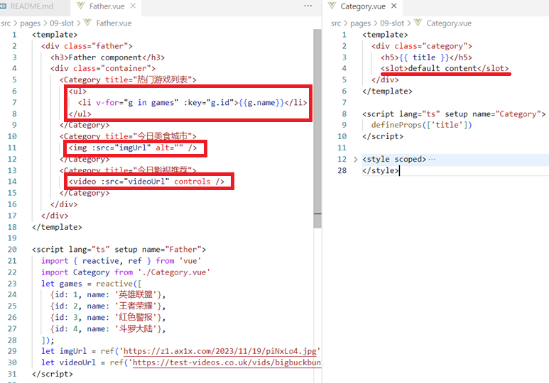
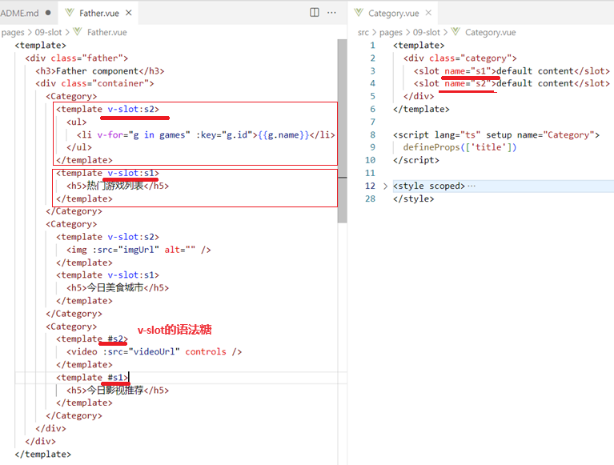
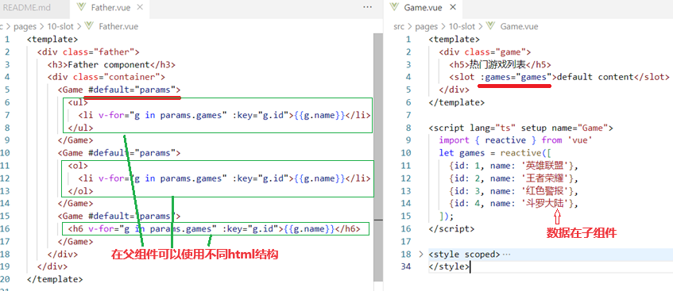

[Vue3学习小结10--slot插槽](#top)

- [默认插槽](#默认插槽)
- [具名插槽](#具名插槽)
- [作用域插槽](#作用域插槽)
- [https://test-videos.co.uk/vids/bigbuckbunny/mp4/h264/360/Big\_Buck\_Bunny\_360\_10s\_1MB.mp4](#httpstest-videoscoukvidsbigbuckbunnymp4h264360big_buck_bunny_360_10s_1mbmp4)

-------------------------------------

- 插槽是一种分发内容的机制，它允许在子组件中插入父组件的任何内容

## 默认插槽

- 如果在子组件中没有指定插槽内容，那么父组件中的内容将会被默认插入
- 

[⬆ back to top](#top)

## 具名插槽

- 在插槽上加上name,可以实现多个结构匹配
- **v-slot必须要加在组件标签或者template标签上**
- 

[⬆ back to top](#top)

## 作用域插槽

- 数据在子组件
- html结构由父组件决定
- 

[⬆ back to top](#top)

> References
- [插槽 Slots-cn-official](https://cn.vuejs.org/guide/components/slots.html)
- https://www.cnblogs.com/Itstars/tag/vue.js/
- [Vue学习计划-Vue3--核心语法（九）slot插槽](https://www.cnblogs.com/Itstars/p/17966825)
