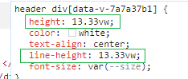

[Vue3学习小结21--开发h5适配](#top)

- [Preparation](#preparation)
- [将px转换为vw的postCss插件- 基于vite](#将px转换为vw的postcss插件--基于vite)
- [切换字体大小](#切换字体大小)

-------------------------------------

## Preparation

1. add following to 'index.html':  `<meta name="viewport" content="width=device-width, initial-scale=1.0" />`
2. Clear old global css and add global css: 

```css
html, body, #app {
  height: 100%;
  overflow: hidden;
}
* {
  padding: 0;
  margin: 0;
}
```

[⬆ back to top](#top)

## 将px转换为vw的postCss插件- 基于vite



1. 根目录新建一个plugins文件夹, 新建两个文件'pxto-viewport.ts', 'type.ts'
2. `tsconfig.node.json`中加入
   1.  `"include": ["vite.config.ts", "plugins/**/*"]`
   2.  `"compilerOptions": { ..., "noImplicitAny": false }`
3. 编写 'pxto-viewport.ts', 'type.ts' 插件文件
4. vite.config.ts 引入写好的插件

```ts
//type.ts
export interface Options {
  viewPortWidth?: number;
  mediaQuery?: boolean;
  unitToConvert?: string;
}
// pxto-viewport.ts
import type { Options } from './type'
import type { Plugin } from 'postcss'

const defaultOptions = {
    viewPortWidth: 375,
    mediaQuery: false,
    unitToConvert:'px'
}
export const pxToViewport = (options: Options = defaultOptions): Plugin => {
    const opt = Object.assign({}, defaultOptions, options)
    return {
        postcssPlugin: 'postcss-px-to-viewport',
        //css节点都会经过这个钩子
        Declaration(node) {
            const value = node.value
            //匹配到px 转换成vw
            if (value.includes(opt.unitToConvert)) {
                const num = parseFloat(value)
                const transformValue = (num / opt.viewPortWidth) * 100
                node.value = `${transformValue.toFixed(2)}vw`            //转换之后的值
            }    
        },
    }
}
// vite.config.ts 引入写好的插件
 css:{
     postcss:{
         plugins:[
            pxToViewport()
         ]
     },
  },
```

[⬆ back to top](#top)

## 切换字体大小

- 传统方法
- 使用vueuse库：`npm i @vueuse/core`

```ts
<template>
  <div>
    <button @click="change(36)">大</button>
    <button @click="change(24)">中</button>
    <button @click="change(14)">小</button>
  </div>
  <div class="content">Content</div>
</template>
<script lang="ts" setup name="App">
  import { reactive, ref } from 'vue'
  import { useCssVar } from '@vueuse/core'
  localStorage.setItem('fontSize', '14px')
  const change = (str: number) => {
    //localStorage.setItem('fontSize', fontDaxiao)
    // traditional method
    //document.documentElement.style.getPropertyValue('--size')
    document.documentElement.style.setProperty('--size', str + 'px');
    const fontSet = document.documentElement.style.getPropertyValue('--size');
    let fontNow = localStorage.getItem('fontSize') as string
    if(fontNow !== fontSet) {
      localStorage.setItem('fontSize', fontSet)
    }
    // vueuse method
    // const color = useCssVar('--size')
    // color.value = `${str}px`
  }
</script>
<style scoped lang="less">
  :root {
    --size: 14px;
  }
  .content {
    font-size: var(--size);
    height: 100px;
    margin: 5px;
    background: skyblue;
  }
  button {
    padding: 5px;
  }
</style>
```

[⬆ back to top](#top)

> References
- [小满zs-csdn博客](https://blog.csdn.net/qq1195566313/category_11618172.html)
- [Vue3（开发h5适配）](https://xiaoman.blog.csdn.net/article/details/132526254)
- [PostCSS- offical](https://www.postcss.com.cn/)
- [vueuse-useCssVar](https://vueuse.org/core/useCssVar/#usecssvar)
