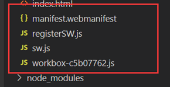

[Vue3学习小结23--Vue3性能优化](#top)

- [Web性能优化](#web性能优化)
- [性能数据分析工具](#性能数据分析工具)
- [vue3+vite项目打包优化](#vue3vite项目打包优化)
- [Vite配置优化](#vite配置优化)
- [PWA离线存储技术](#pwa离线存储技术)
- [其他性能优化](#其他性能优化)
  - [图片懒加载](#图片懒加载)
  - [虚拟列表](#虚拟列表)
  - [多线程- Web Worker](#多线程--web-worker)
  - [防抖节流](#防抖节流)

-------------------------------------

## Web性能优化

Web 性能优化主要有两个方面：

1. 页面加载性能
   - 首次访问时，应用展示出内容与达到可交互状态的速度
   - 这通常会用 Google 所定义的一系列 Web 指标 (Web Vitals) 来进行衡量，如最大内容绘制 (Largest Contentful Paint，缩写为 LCP) 和首次输入延迟 (First Input Delay，缩写为 FID)。
2. 更新性能
   - 应用响应用户输入更新的速度。比如当用户在搜索框中输入时结果列表的更新速度，或者用户在一个单页面应用 (SPA) 中点击链接跳转页面时的切换速度

## 性能数据分析工具

- WebPageTest
- rollup-plugin-visualizer
- Chrome DevTools LightHouse参数

|||
|---|---|
|FCP (First Contentful Paint)|首次内容绘制的时间，浏览器第一次绘制DOM相关的内容，也是用户第一次看到页面内容的时间|
|Speed Index:|页面各个可见部分的显示平均时间，当我们的页面上存在轮播图或者需要从后端获取内容加载时，这个数据会被影响到|
|LCP (Largest Contentful Paint)|最大内容绘制时间，页面最大的元素绘制完成的时间|
|TTI（Time to Interactive）|从页面开始渲染到用户可以与页面进行交互的时间，内容必须渲染完毕，交互元素绑定的事件已经注册完成。
|TBT（Total Blocking Time）|记录了首次内容绘制到用户可交互之间的时间，这段时间内，主进程被阻塞，会阻碍用户的交互，页面点击无反应|
|CLS（Cumulative Layout Shift）|计算布局偏移值得分，会比较两次渲染帧的内容偏移情况，可能导致用户想点击A按钮，但下一帧中，A按钮被挤到旁边，导致用户实际点击了B按钮|

[⬆ back to top](#top)

## vue3+vite项目打包优化

- vite打包是基于rollup 的,可以使用 rollup 的插件
- `npm install rollup-plugin-visualizer`
- 修改'vite.config.ts' 配置
  - `plugins: [vue(), vueJsx(), visualizer({open: true})]`
- `npm run build`
- 成功后会生成'stats.html'

```ts
import { visualizer } from 'rollup-plugin-visualizer';
export default defineConfig({
  plugins: [vue(), visualizer({
    emitFile: false,
    file: "stats.html",   //optional, 分析图生成的文件名
    open:true             //如果存在本地服务端口，将在打包后自动展示
  })],
})
```

|参数|类型|解释|
|---|---|---|
|filename/file |string | 生成分析的文件名|
|title | string | html标签页标题|
|open | boolean | 以默认服务器代理打开文件|
|template | string | 可选择的图表类型|
|template | string | 可选择的图表类型|
|BrotliSize | boolean | 搜集brotli压缩包的大小到图表|
|emitFile | boolean | 使用emitFile生成文件，简单说，这个属性为true,<br>打包后的分析文件会出现在打包好的文件包下，<br>否则就会在项目目录下|
|sourcemap | boolean |使用sourcemap计算大小|
|projectRoot | string， RegExp|文件的根目录，默认在打包好的目录下|

[⬆ back to top](#top)

## Vite配置优化

- 修改'vite.config.ts'配置, 加入：

```ts
build:{
  chunkSizeWarningLimit:2000,
  cssCodeSplit:true,               //css 拆分
  sourcemap:false,                 //不生成sourcemap
  minify:false,                    //是否禁用最小化混淆，esbuild打包速度最快，terser打包体积最小。
  assetsInlineLimit:5000           //小于该值 图片将打包成Base64 
},
```

[⬆ back to top](#top)

## PWA离线存储技术

1. `npm install vite-plugin-pwa -D`
2. 修改'vite.config.ts'配置, 加入：
   - `import { VitePWA } from 'vite-plugin-pwa'`
   - `plugins: [vue(), vueJsx(),VitePWA(),visualizer({open: true})]`
3. 进行`npm run build` 打包会生成
   -  
4. VitePWA的配置案例('vite.config.ts')

```ts
VitePWA({
  workbox:{
    cacheId:"Xiaoman",                  //缓存名称
    runtimeCaching:[
      {
        urlPattern:/.*\.js.*/,          //缓存文件
        handler:"StaleWhileRevalidate", //重新验证时失效
        options:{
          cacheName:"XiaoMan-js",        //缓存js，名称
          expiration:{
             maxEntries:30,               //缓存文件数量 LRU算法
            maxAgeSeconds:30 * 24 * 60 * 60 //缓存有效期
          }
        }
      }
    ]
  },
})
```

[⬆ back to top](#top)

## 其他性能优化

### 图片懒加载

- `import lazyPlugin from 'vue3-lazy'`
- ``

### 虚拟列表

- 渲染**大型列表**的时候不需要立刻渲染出全部的列表。在大多数场景中，用户的屏幕尺寸只会展示这个巨大列表中的一小部分。可以通过列表虚拟化来提升性能，这项技术使我们只需要渲染用户视口中能看到的部分。
- Element UI: Virtualized Table
- [vue-virtual-scroller](https://github.com/Akryum/vue-virtual-scroller?spm=a2c6h.12873639.article-detail.7.48061d4dZTZrQt)
- [vue-virtual-scroll-grid](https://github.com/rocwang/vue-virtual-scroll-grid?spm=a2c6h.12873639.article-detail.8.48061d4dZTZrQt)
- [vueuc/VVirtualList](https://github.com/07akioni/vueuc?spm=a2c6h.12873639.article-detail.9.48061d4dZTZrQt)

### 多线程- Web Worker

- 使用 `new Worker` 创建
- VueUse 库已经集成了[useWebWorker](https://vueuse.org/core/useWebWorker/#usewebworker)

```ts
// worker脚本与主进程的脚本必须遵守同源限制。他们所在的路径协议、域名、端口号三者需要相同
const myWorker1 = new Worker("./calcBox.js");
//都使用postMessage发送消息
worker.postMessage(arrayBuffer, [arrayBuffer]);
//都使用onmessage接收消息
self.onmessage = function (e) {
    // xxx这里是worker脚本的内容
};
// 关闭
worker.terminate();    
```

### 防抖节流

- VueUse 库已经集成了[useDebounceFn](https://vueuse.org/shared/useDebounceFn/#usedebouncefn)


|||
|---|---|
|使用静态属性|可以使用**h函数**来创建静态的节点，这些节点在更新时不会重新渲染，从而提高性能|
|避免不必要的响应式数据| |
|路由懒加载|页面的组件在需要时再进行加载|
|懒加载组件|可以使用`defineAsyncComponent`来实现组件的懒加载，当组件需要时再进行加载，提高页面加载速度|
|使用Memoize|可以使用watchEffect和computed进行依赖数据的监听，<br>但是有些计算量较大的操作可以使用Memoize缓存计算结果，避免重复计算，提高性能|
|预加载||
|第三方库CDN引入|cdn管理插件 -> vite-plugin-cdn-import|
|设置合适的缓存策略|`keep-alive`、本地存储（如localStorage、sessionStorage）以及cookie|
|gzip压缩文件|`vite-plugin-compression`<br>gzip不只是需要在打包的时候生成，也需要在web服务里开启功能|


[⬆ back to top](#top)

> References
- [小满zs-csdn博客](https://blog.csdn.net/qq1195566313/category_11618172.html)
- [小满Vue3第四十四章（Vue3 性能优化）](https://xiaoman.blog.csdn.net/article/details/126811832)
- [性能优化-official](https://cn.vuejs.org/guide/best-practices/performance)
- [【 Vue3 性能优化】页面加载性能 与 更新性能](https://developer.aliyun.com/article/1262596#slide-0)
- [Vue3中如何进行性能优化？](https://blog.csdn.net/yuanlong12178/article/details/138022322)
- [vite + vue3 关于项目性能优化](https://juejin.cn/post/7306329426282348582)
- [关于vite4+vue3+ts项目搭建到后面项目打包优化和性能优化的过程](https://juejin.cn/post/7234763686476021819)
- [vue3 + vite项目打包优化](https://juejin.cn/post/7293887184921264154)
