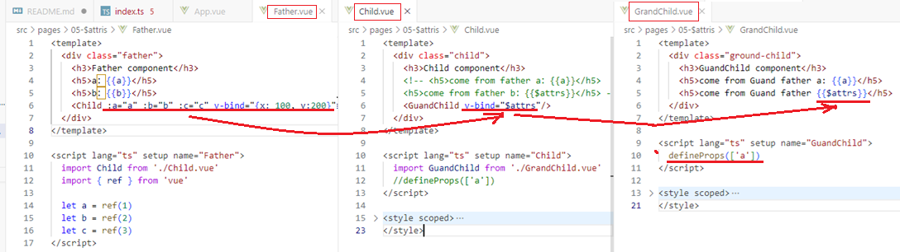
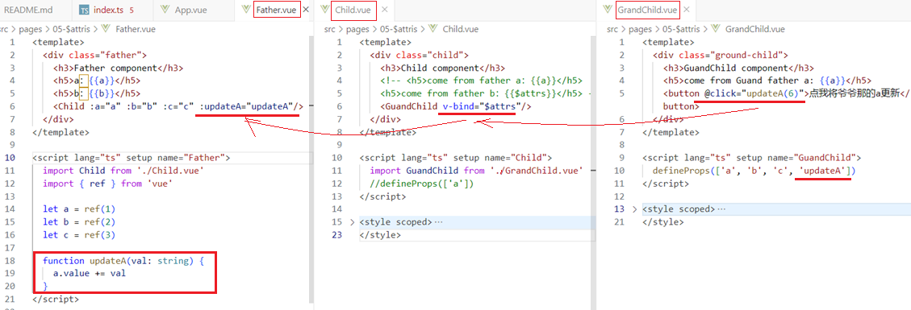
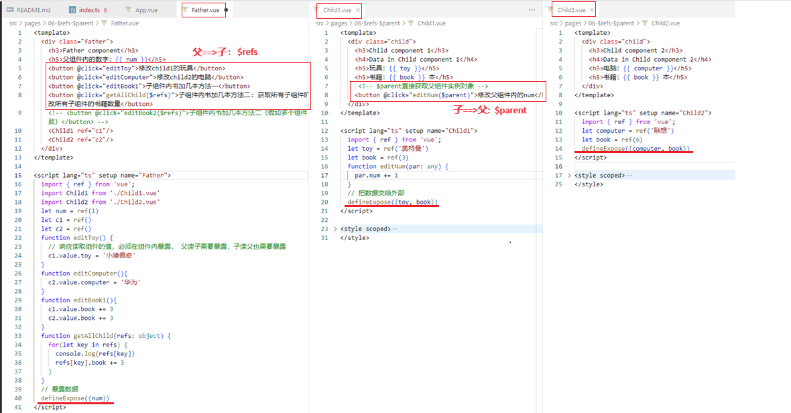
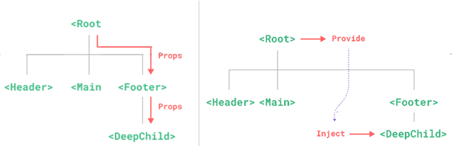
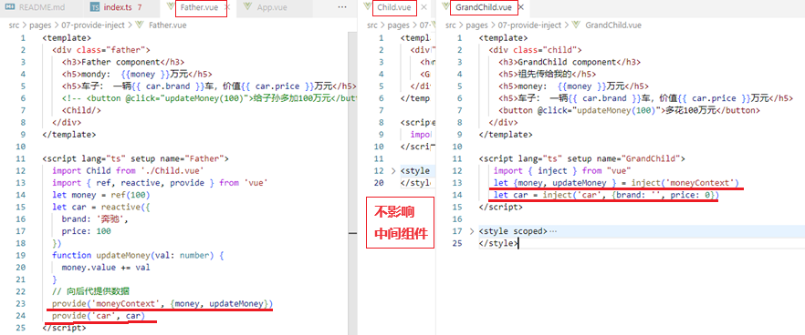

[Vue3学习小结9--组件通信](#top)

- [常见搭配形式](#常见搭配形式)
  - [Vue3组件通信和Vue2的区别：](#vue3组件通信和vue2的区别)
- [props](#props)
- [自定义事件](#自定义事件)
- [mitt plugin](#mitt-plugin)
- [v-model](#v-model)
  - [v-model的本质](#v-model的本质)
  - [多次使用v-model](#多次使用v-model)
- [`$attrs`](#attrs)
- [`$refs` and `$parent`](#refs-and-parent)
- [依赖注入provide、inject](#依赖注入provideinject)

-------------------------------------

## 常见搭配形式

|组件关系|传递方式|
|---:|:---|
|父传子|1. props<br>2. v-model<br>3. $refs<br>4.默认插槽、具名插槽|
|子传父|1. props<br>2. 自定义事件<br>3. v-model<br>4. $parent<br>5. 作用域插槽|
|祖传孙、孙传祖|1. $attrs<br>2. provide, inject|
|兄弟间|1. mitt<br>2. pinia|

### Vue3组件通信和Vue2的区别：

- 移出事件总线，使用mitt代替
- vuex换成了pinia
- 把.sync优化到了v-model里面了
- 把$listeners所有的东西，合并到$attrs中了
- $children被砍掉了

[⬆ back to top](#top)

## props

- props是使用频率最高的一种通信方式，常用与 ：**父 <=> 子**
- 若**父传子**：属性值是非函数: `<Child :car="car"/>`
- 若**子传父**：属性值是函数:  `<Child :sendToy="getToy"/>`

```ts
// 父组件
<template>
  <div class="father">
    <h3>父组件</h3>
		<h4>父组件内的值： {{ car }}</h4>
		<h4 v-show="toy">子传给父的值： {{ toy }}</h4>
		<Child :car="car" :sendToy="getToy"/>
  </div>
</template>
<script setup lang="ts" name="Father">
	import Child from './Child.vue'
	import { ref } from 'vue'
	let car = ref('奔驰')
	let toy = ref('')
	function getToy(value){
		toy.value = value
	}
</script>
//子组件
<template>
  <div class="child">
    <h3>子组件</h3>
		<h4>子组件内的值：{{ toy }}</h4>
		<h4>父亲传过来的值：{{ car }}</h4>
		<button @click="sendToy(toy)">将子组件的值传给父组件</button>
  </div>
</template>
<script setup lang="ts" name="Child">
import {ref,onMounted} from 'vue'
defineProps(['car', 'sendToy'])
let toy = ref('玩具熊')
</script>
```

[⬆ back to top](#top)

## 自定义事件

- 自定义事件常用于：**子 => 父**
- **原生事件**
  - 事件名是特定的(`click`,`mouseenter`等等)
  - 事件对象$event：包含事件相关信息的对象(`pageX`,`pageY`,`target`,`keyCode`)
- **自定义事件**
  - 事件名称是任意名称
  - 事件对象`$event`: 调用`emit`时所提供的数据，可以是任意类型
  - 推荐使用kebab-case规范

```ts
// 父组件
<Child @send-toy="saveToy"/>   //给子组件绑定自定义事件
function saveToy(val:string){
  toy.value = val
}
// 子组件
// 调用自定义事件
<button button @click="emit('send-toy', toy)">传递数据</button>
// 声明自定义事件
const emit =defineEmits(['send-toy'])
```

[⬆ back to top](#top)

## mitt plugin

- 概述：与消息订阅与发布（pubsub）功能类似，可以实现任意组件间通信- functional event emitter
- 步骤
  - 安装mitt：`npm i mitt`
  - 新建文件：`src\utils\emitter.ts`
- 注意： 组件卸载时候解绑事件， `onUnmounted(()=>{ emitter.off('send-toy') })`

```ts
//1) src\utils\emitter.ts
import mitt from 'mitt'
// 创建emitter
const emitter = mitt()
export default emitter
// 2) 接收数据组件中：绑定事件、同时在销毁前解绑事件
<template>
  <div class="child2">
    <h3>子组件2</h3>
    <h4>电脑：{{ computer }}</h4>
    <h4>哥哥给的玩具：{{ toy }}</h4>
  </div>
</template>
<script setup lang="ts" name="Child2">
  import {ref,onUnmounted} from 'vue'
  import emitter from '@/utils/emitter';
  // 数据
  let computer = ref('联想')
  let toy = ref('')
  emitter.on('send-toy', (val: string)=>{
    toy.value = val
  })
  onUnmounted(()=>{
    emitter.off('send-toy')
  })
</script>
//提供数据的组件中，在合适的时机触发事件
<template>
  <div class="child1">
    <h3>子组件1</h3>
    <h4>玩具：{{ toy }}</h4>
    <button @click="emitter.emit('send-toy', toy)">传递数据</button>
  </div>
</template>
<script setup lang="ts" name="Child1">
  import {ref} from 'vue'
  import emitter from '@/utils/emitter'
  // 数据
  let toy = ref('奥特曼')
</script>
```

[⬆ back to top](#top)

## v-model

- 概述：实现 **父 <=> 子** 之间相互通信
- 组件标签上的**v-model的本质**：`:moldeValue` ＋ `update:modelValue`事件

```html
<!--原生DOM输入框使用v-mdoel:双向绑定-->
<input type="text" v-model="username">
<!--v-model本质: 传一个动态属性value，并在input事件修改username值 -->
<input type="text" :value="username" 
  @input="username=(<HTMLInputElement>$event.target).value"
>
```

### v-model的本质

- 父组件中: Father.vue

```html
<!-- 组件身上使用v-model -->
<MyInput v-mdoel="username"/>
<!-- 本质相当于 -->
<MyInput :modelValue="username" @update:modelValue="username = $event"/>
```

- 自定义组件中 - TestInput.vue

```html
<template>
  <div>
    <!--将接收的value值赋给input元素的value属性，目的是：为了呈现数据 -->
    <!--给input元素绑定原生input事件，触发input事件时，进而触发update:model-value事件-->
    <input 
      type="text"
      :value="modelValue"
      @input="emits('update:modelValue', (<HTMLInputElement>$event.target).value)"
    >
  </div>
</template>
<script setup lang="ts" name="MyInput">
defineProps(['modelValue'])
// 声明自定义事件 update:modelValue
const emits = defineEmits(['update:modelValue'])
</script>
```

- **$event的实质**
- 对于原生事件， $event就是事件对象，可以`$event.target`
- 对于自定义事件，$event就是触发事件时，所传递的数据，不可以`$event.target`

### 多次使用v-model

- v-model后面跟自定义名称, 相当于别名，这样的话可以使用多次v-model

```html
<!-- 父组件中 -->
<MyInput v-model="username" v-model:abc="abc"/>
<!--子组件中-->
<template>
  <div>
    <input type="text" :value="modelValue"
      @input="emits('update:modelValue', (<HTMLInputElement>$event.target).value)"
    >
    <br>
    <input type="text" :value="abc"
      @input="emits('update:abc', (<HTMLInputElement>$event.target).value)"
    >
  </div>
</template>
<script setup lang="ts" name="MyInput">
defineProps(['modelValue','abc'])
// 声明自定义事件 update:modelValue
const emits = defineEmits(['update:modelValue', 'update:abc'])
</script>
```

[⬆ back to top](#top)

## `$attrs`

- 概述：`$attrs`用于实现当前组件的父组件，向当前组件的子组件通信（**祖 <==> 孙**）
- 具体说明：$attrs是一个对象，包含所有父组件传入的标签属性
- 注意：`$attrs`会自动排除`props`中声明的属性(可以认为声明过的 `props` 被子组件自己“消费”了)(相当于：组件中没被`defineProps`声明接收的属性)


- 
- 

[⬆ back to top](#top)

## `$refs` and `$parent`

||||
|---|---|---|
|$refs|父==>子|值为对象，包含所有被ref属性标识的DOM元素或组件实例|
|$parent|子==>父|值为对象，当前组件的父组件实例对象|



[⬆ back to top](#top)

## 依赖注入provide、inject

- 实现**祖 <==> 孙**组件**直接**通信, 不用中间组件
- 
- 具体使用：
  - 在祖先组件中通过provide配置向后代组件提供数据
  - 在后代组件中通过inject配置来声明接收数据
- 

[⬆ back to top](#top)

> References
- [pinia-cn-official](https://pinia.vuejs.org/zh/)
- [mitt](https://github.com/developit/mitt)
- https://www.cnblogs.com/Itstars/tag/vue.js/
- [Vue学习计划-Vue3--核心语法（八）组件通信](https://www.cnblogs.com/Itstars/p/17966827)
