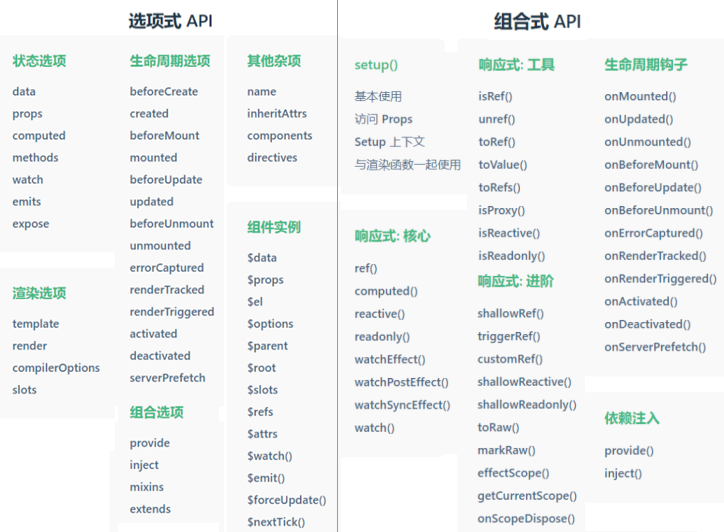

[Vue3学习笔记](#top)
- [vue特性](#vue特性)
- [Vue2 vs Vue3](#vue2-vs-vue3)
  - [创建项目的环境](#创建项目的环境)
  - [对TS的支持程度](#对ts的支持程度)
  - [API风格](#api风格)
  - [数据状态的创建方式](#数据状态的创建方式)
- [Vue3 installation](#vue3-installation)

-------------------------------------------------------------

## vue特性

|特性|说明|图示|
|---|---|---|
|数据驱动视图|在使用了vue的页面中，vue会监听数据的变化，从而自动重新渲染页面的结构||
|双向数据绑定|||
|MVVM|vue实现数据驱动视图和双向数据绑定的核心原理 1. Model表示当前页面渲染时所依赖的数据源 2. view表示当前页面所渲染的DOM结构    3. ViewModel表示vue的实例，它是MVVM的核心||

[⬆ back to top](top)

## Vue2 vs Vue3

### 创建项目的环境

- Vue2环境的创建主要通过官方提供的VueCL脚手架进行创建，VueCL脚手架是基于webpack的静态打包工具
  - webpack是一个用于现代JavaScript应用程序的 静态模块打包工具。当 webpack 处理应用程序时，它会在内部从一个或多个入口点构建一个 依赖图(dependency graph)，然后将你项目中所需的每一个模块组合成一个或多个 bundles，它们均为静态资源，用于展示你的内容。
  - `npm install -g @vue/cli`
  - `vue create my-project`
- Vue3不再使用webpack而是使用自家研发的Vite作为静态打包构建工具
  - Vite是下一个现代的前端开发与构建工具，其构建速度比webpack更加快速，无论应用程序大小如何，都始终极快的模块热替换（HMR），对 TypeScript、JSX、CSS 等支持开箱即用，对Vue提供了一等公民支持
  - `npm create vue@latest`

### 对TS的支持程度

- Vue2/3都支持TS，因为Vue本身就是使用TS写的，但Vue3对于TS的支持程度及性能会更加友好，因为Vite本身对TS也是开箱即用的，不需要过多配置。
- 而Vue2需要一些配置且对于较大的项目来说可能会遇到性能瓶颈，例如可能半天才会TS类型提示，对于新项目建议使用Vue3配合Vite开发，对于Vue2老项目官方也建议迁移到Vite上进行开发

### API风格

- vue2只有选项式API（options API），Vue3在此基础上增加了组合式API（composition API），也就是说Vue3中既可以用选项式API也可以用组合式API进行开发
- [选项式API](https://cn.vuejs.org/guide/introduction.html#api-styles) 以“组件实例”的概念为中心 (即上述例子中的 this)，对于有面向对象语言背景的用户来说，这通常与基于类的心智模型更为一致。同时，它将响应性相关的细节抽象出来，并强制按照选项来组织代码，从而对初学者而言更为友好
  - 选项式开发其实就是在固定的实例中做固定的事情，可以通过this访问相应实例，非常直观又好理解。另外选项式API中也可以使用setup（）的方式使用组合式函数API
- [组合式API](https://cn.vuejs.org/guide/introduction.html#api-styles) 的核心思想是直接在函数作用域内定义响应式状态变量，并将从多个函数中得到的状态组合起来处理复杂问题。这种形式更加自由，也需要你对 Vue 的响应式系统有更深的理解才能高效使用。相应的，它的灵活性也使得组织和重用逻辑的模式变得更加强大。
  - 组合式开发摆脱了以往的固定实例束缚，可以在任何地方使用组合式API，比如说在.js文件中，甚至可以从.js文件中导出响应性的状态，相当于一个.js文件就是一个组件，而这个组件中既可以用组合式的API也可以享受到强大的原生js的编程能力
- 

|选项式API|组合式API|
|---|---|
|未使用构建工具时 （未使用构建工具时一般都会使用选项式，因为组合式是针对单文件组件的。如：在传统的HTML中经常使用选项式API，开发特别方便）|使用构建工具|
|项目复杂度较低时|在单文件组件中（*.vue）|
|渐进增强的应用||

[⬆ back to top](top)

### 数据状态的创建方式

- Vue2创建数据主要通过`data(){ return {}}`中创建数据，以函数形式返回状态这样每个组件会创建一个独立的数据，组件与组件间状态互不影响。
- Vue3的数据状态主要通过`ref`和`reactive`来创建，他们都会返回一个响应性的对象，其中在函数中访问`ref`时需要通过`.value`的形式访问定义的状态，在template中则不需要它会自动解包

## Vue3 installation

[⬆ back to top](top)

> references
- [Vuejs官网](https://vuejs.org/guide/quick-start)
- [Vue2/Vue3的区别及使用差异](https://youmoxiang.blog.csdn.net/article/details/132024042)
