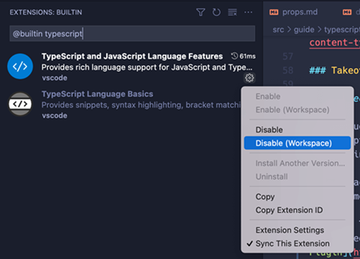

[关于VScode vue3卡顿](#top)

- 在使用vscode+volar开发vue3项目时，出现代码提示缓慢的问题。通过开启[Volar Takeover](https://cn.vuejs.org/guide/typescript/overview.html#volar-takeover-mode)在使用vscode+volar开发vue3项目时，出现代码提示缓慢的问题。通过开启Volar Takeover *模式解决。
- 为了优化性能，Volar 提供了一个叫做“Takeover 模式”的功能。在这个模式下，Volar 能够使用一个 TS 语言服务实例同时为 Vue 和 TS 文件提供支持。
- 要开启 Takeover 模式，需要执行以下步骤来在项目的工作空间中禁用 VSCode 的内置 TS 语言服务：
  1. 在当前项目的工作空间下，用 Ctrl + Shift + P (macOS：Cmd + Shift + P) 唤起命令面板
  2. 输入 built，然后选择“Extensions：Show Built-in Extensions”
  3. 在插件搜索框内输入 typescript (不要删除 @builtin 前缀)
  4. 点击“TypeScript and JavaScript Language Features”右下角的小齿轮，然后选择“Disable (Workspace)”
  5. 重新加载工作空间。Takeover 模式将会在打开一个 Vue 或者 TS 文件时自动启用

> https://www.cnblogs.com/Nicander/p/17097402.html
