|Question|Answer|
|---|---|
|Tell me about yourself||
|Why did you decide to become a Software Engineer? |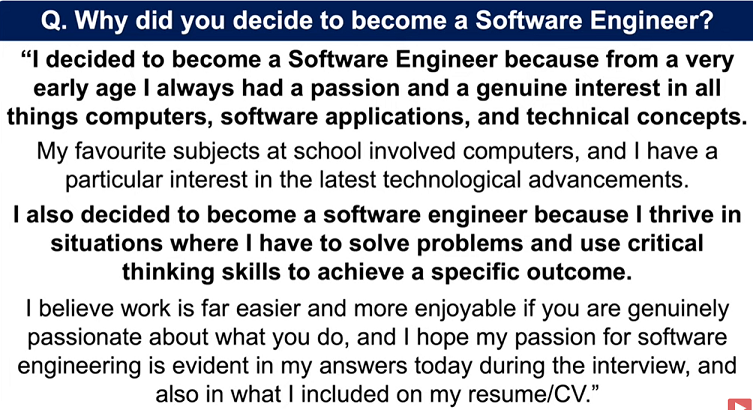|
|Tell me about a project you completed successfully|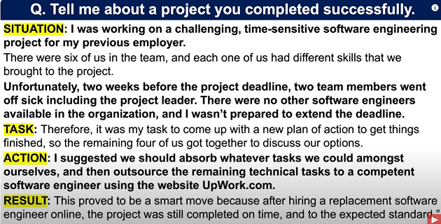|
|What are the most important skills and qualities needed to become a great Software Engineer? ||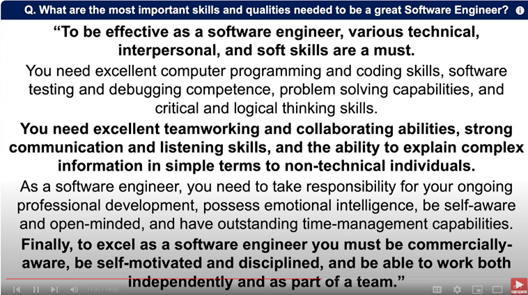|
|What’s your biggest weakness? |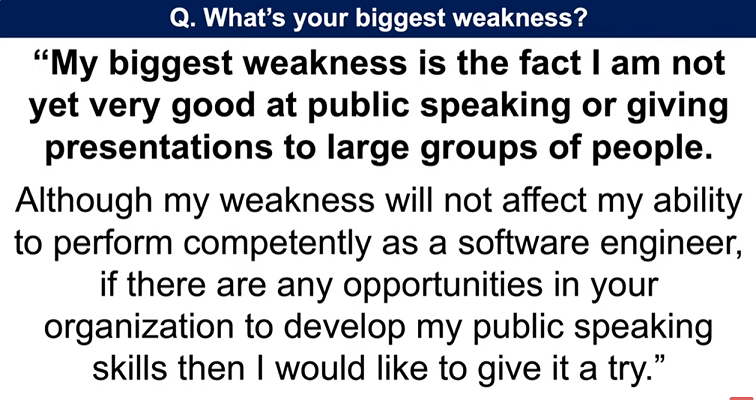|
|Why should we hire you as a Software Engineer? |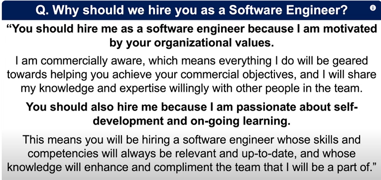|
|Why do you want to work for our company as a Software Engineer?|
|What do you like and dislike the most about being a Software Engineer?|
|What can you bring to our company?|
|How would you deal with a situation where a manager insisted on a project specification that you knew was not workable?|
|What steps do you take to keep your technical knowledge as a Software Engineer relevant and up-to-date?|
|How did your previous company benefit from your technical knowledge and expertise?|
|How would you explain something technical to a non-technical person? |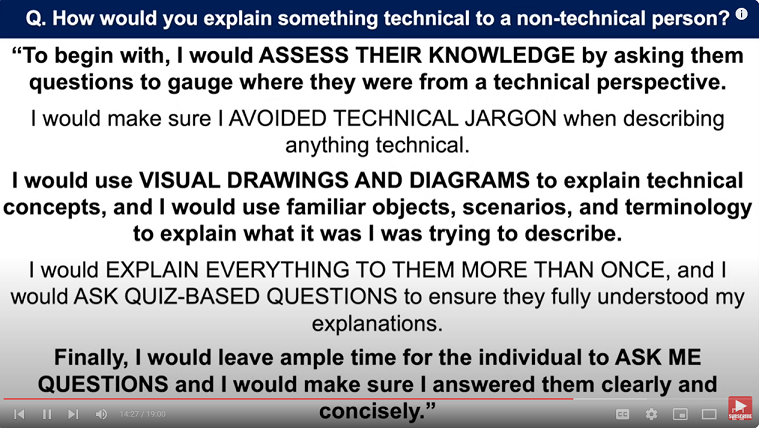|
| When you encounter bugs and issues during software engineering projects, what problem-solving process do you use?||
|How would you respond to a team member who disagreed with the work you’ve carried out as a Software Engineer?|
|How many streetlights are there in this country?||
|Tell me a time when you worked as part of a team to solve a complex task.||
|Why are manhole covers round?||
| Where do you see yourself in 5 years?||
|How you would handle the stress and pressure of being a Software Engineer? ||
|Why do you want to leave your current job?||
|What are your strengths? ||
|What are your salary expectations as a Software Engineer?||
|That’s the end of your Software Engineer interview, do you have any questions for the panel?||
|Tell me about a time when you had to manage competing deadlines|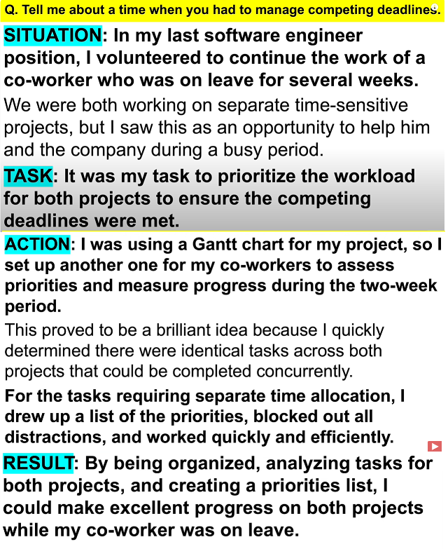|
|Tell me about yourself and why you wnat to become a software Engineer| 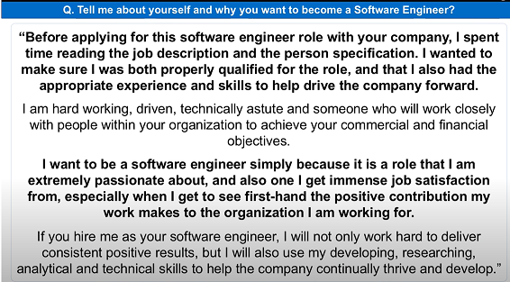|
|What skills and qualities are needed to be a software engineer?|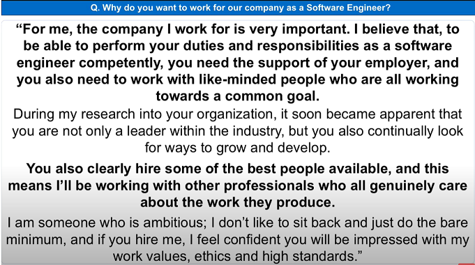|
|Tell me what you expect to be doing on a daily basis as a software engineer?|**Coding**: Writing and optimizing front-end code in HTML, CSS, and JavaScript. **Collaboration**: Working with designers and back-end developers to integrate and refine features. **Testing**: Ensuring cross-browser compatibility and responsive design. **Problem-Solving**: Debugging issues and improving user experience. **Debugging and troubleshooting** any front-end issues that arise, and implementing fixes to improve the user experience. **Participating in code reviews** to maintain code quality and share knowledge with peers. **Staying informed about new technologies** and industry best practices to continuously refine my skills and apply innovative solutions.|
|What are your strengths?||
|What are your weaknesses?|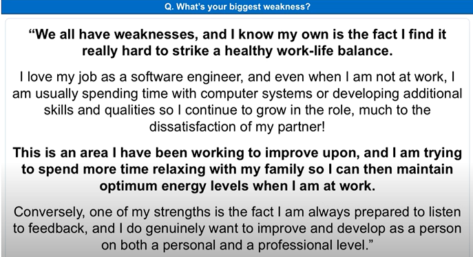|
|What are your weaknesses?|I have trouble asking for help & may overcommit or refrain from delgating, even though I am burning out. I have learned to recognize when I am feeling burned out so I can reach out for help. While I do enjoy working independently,  I have been able to produce high-quality work when I'm able to pull others in and collaborate. I sometimes lack confidence which can prevent me from speaking up or contributing in a meeting or conversation. I have been intentional about voicing my ideas an optnions in meetings when I feel it is appropriate and will add value.  Because of this, my team ended up running with my idea for managing customer inquiries, and our customer satisfaction ratings increased from 89% to 98%|
|What are your salary expectations as a software engineer?|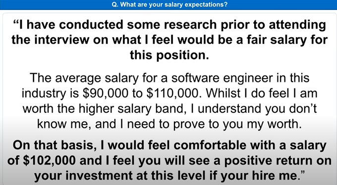|
|Where do you see yourself in five years' time?||
|Why should we hire you?||
|Why do you want to work for our company as a Software Engineer?
|How would you deal with a member of your team who disagreed with the work you carried out as a Software Engineer?|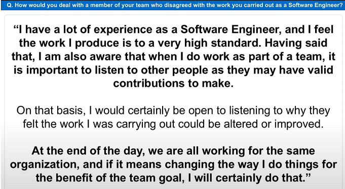|
|Tell me a time when you worked as part of a team to solve a complex task?|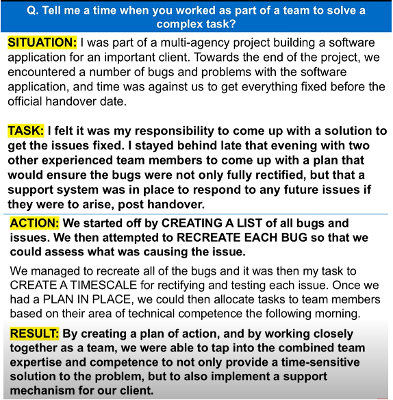|
|Tell me how you would handle the stress and pressure of being a Software Engineer? |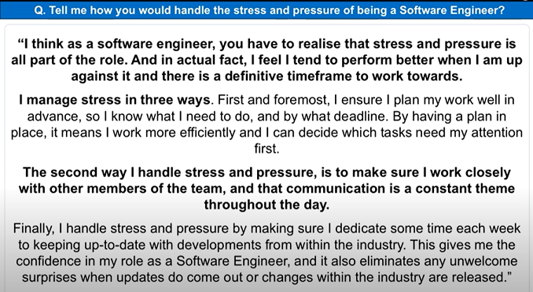|
|What are the skills and qualities needed to be a software Engineer?|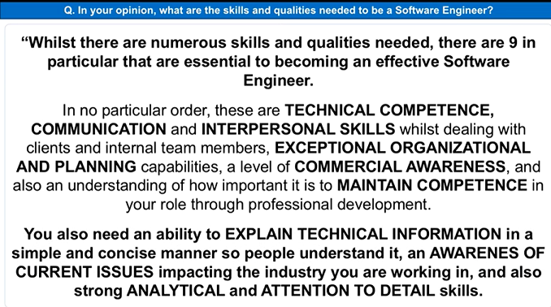|
|ask questions|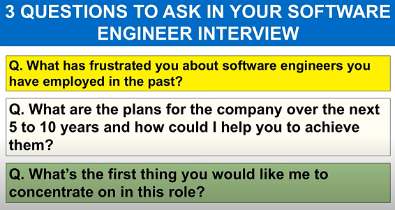 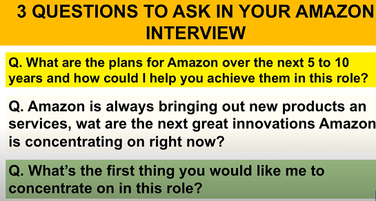|

## Questions to ask at the End of an Interview
- 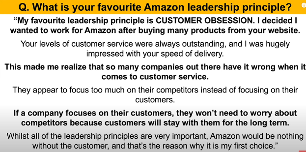
- What is your favorite part about working here in this organization.
- What make people stay in this organization
- What is biggest challenges or opportuntie of this organization or department is facing in the next six months to a year
- how did u describe the work environment here
- Role-based
  - Could u tell me a typical day or week looks like in this position 
  - what u want a person in this position to accomplish in their first 30, 60 and 90 days
  - What challenges or opportunties do u foresee thsi position taking on in next six months
  - How my performance be measured in this position
  - What are the next steps in the interview process
- Hesitation question
  - Based on what we've talked about today, is there anything that is causing you hesitation about my fit for this position
  - How do I compare to other candidates you've interviewed for this role
  - do you have any hesitations about my qualifications
  - Is there anything I can clarify for you
  - Have I answered all of the questions that you have for me|
