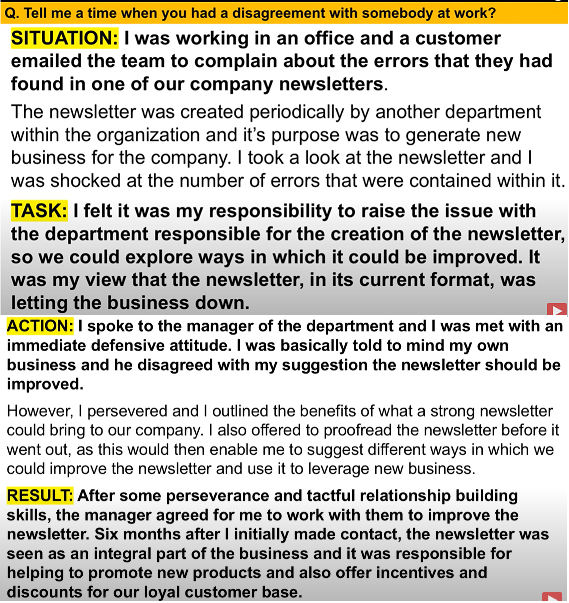
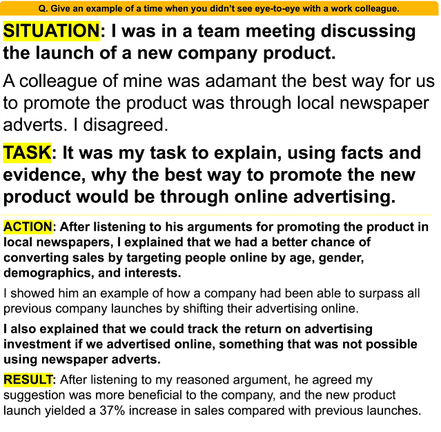
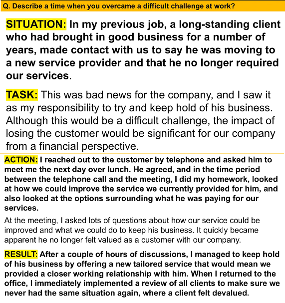
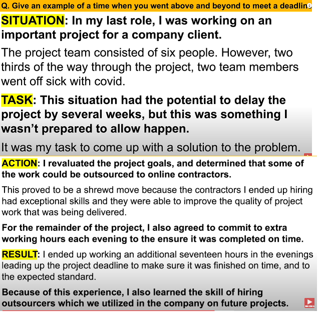

## Amazon Leadership Principles

|1. Customer Obsession 顾客至尚|answers|
|---|---|
|1)Tell me a time when you were able to foresee a customer problem?||
|2)tell me a time when you had to say NO to a customer?|**Situation:** I was working as a customer service representative at an online travel agency, and I received a call from a customer who wanted to cancel his flight booking and get a full refund.   **Task:** My task was to handle the customer’s request and explain the company’s cancellation policy, which stated that cancellations made less than 24 hours before the departure time would incur a 50% penalty fee.   **Action:** I empathized with the customer and acknowledged his frustration, but I also explained the reason behind the policy and why we could not waive the fee. I offered him some alternatives, such as changing his flight date or destination, or transferring his booking to someone else. I also reminded him of the benefits of our loyalty program, which would give him discounts and rewards for future bookings.   **Result:** The customer was initially angry and insisted on getting a full refund, but after I calmly and politely explained the situation and offered him some options, he eventually agreed to change his flight date and pay a smaller fee. He also thanked me for being helpful and professional, and said he would book with us again. I was able to retain the customer and avoid losing revenue for the company.|
|------------------------------|---------------------------------------------|
|2. Ownership 主人翁精神<td colspan='2'>|</td>
|1) Tell me a time when you thought you were going to miss a project or task deadline||
|2) Tell me a time when you helped a co-worker with a difficult task||
|3) Tell me about a time when you failed at work.|**Situation:** I don't like to fail, but if I do, I always take ownership, put things right, and above all, view it as an opportunity to learn, grow and develop.   During a challenging and exciting project at work in a previous role, I was part of a team of talented people who were working on the creaton of a new product for an important client   **Task:** The task required us to work together as a team and use our combbined expertise and experience to create the product for the client within very strict timescales and specifications. The project should have been a breeze, simple because we had done this type of work together many times before  **Action:** we started out as usual with the project manage giving the team the usual brief. I can remember thinking the brief was perhaps not clear enough for the specification requied by the client, but I chose not to say anything, which ended up being a huge mistake.  Part-way through the project, it became apparent we had missed a very important specification off the product, which ended up putting us two weeks behind schedule  **Result:** Although the client was forgiving and he allowed us additional time to complete the project, we had failed to deliver on our promises as a team. During the team debrief, I disclosed I had concerns during the initial team briefing, but I chose not to say anything. I apologized for not doing so. As a team, we learnt a lot from that experience, and moving forward the same mistake never happened again.|
|------------------------------|---------------------------------------------|
|3. Invent and Simplify 创新简化|answers|
|1) Tell me a time when you were able to make something at work simpler and easier to use||
|2) Maketell me a time where your idea had a positive impact on a team or organization||
|------------------------------|---------------------------------------------|
|4. Are Right, A Lot 决策正确|answers|
|1) Tell me a time when you didn't have enough information to make an important decision||
|2) Tell me a time when you looked at things from a different angle to solve a problem||
|------------------------------|---------------------------------------------|
|5. Learn and Be Curious 好奇求知|answers|
|1) Tell me a time when you were unsure of what to do? What the situation and how did you make the right decision?||
|2) Tell me a time when someone challenged your point of view?||
|3) I asked my manager a number of questions because I wanted to learn more about how things were done|I asked my manager for feedback on my performance because I wanted to improve  I am currently reading the book xxx to improve my workplace and leadership skills|
|------------------------------|---------------------------------------------|
|6. Hire and Develop the Best 选贤育能|answers|
|1) Tell me a time when you went out of your way to help someone in your team reach their full potential||
|2) Tell me a time when gave someone constructive feedback at work||
|------------------------------|---------------------------------------------|
|7. Insist on the Highest Standards 最高标准|answers|
|1) Tell me a time when you insisted on doing something the right way||
|2) Tell me a situation where you wish you'd have done things differently||
|------------------------------|---------------------------------------------|
|8. Think Big 远见卓识|answers|
|I weighed up the options carefully and I felt the risk worth taking because the company stood to benefit significantly if it paid off|I spoke to the people in my team to try and establish a different way of approaching the task|
|------------------------------|---------------------------------------------|
|9. Bias for Action 崇尚行动|answers|
|------------------------------|---------------------------------------------|
|10. Frugality 勤俭节约|answers|
|I had some spare time one afternoon and so I decided to go through the office expenditure list to see if I could find the company ways of saving money||
|Tell me about a time when you helped a team to save money||
|------------------------------|---------------------------------------------|
|11. Earn Trust 赢得信任|answers|
|------------------------------|---------------------------------------------|
|12. Dive Deep 刨根问底|answers|
|------------------------------|---------------------------------------------|
|13. Have Backbone; Disagree and Commit 敢于谏言，服从大局|
|1) Tell me a time when you had disagreement with someone at work| |
|2) Give an example of a time when you didn't see eye-to-eye with a work colleague||
|------------------------------|---------------------------------------------|
|14. Deliver Results 达成业绩|answers|
|1) describe a time when you overcame a difficult challenge at work||
|2) Give an example of a time when you went above and beyond to meet a deadline||
|------------------------------|---------------------------------------------|
|15. Strive to be Earth’s Best Employer 致力于成为全球最佳雇主|answers|
|------------------------------|---------------------------------------------|
|16. Success and Scale Bring Broad Responsibility 成功和规模带来更大的责任|
